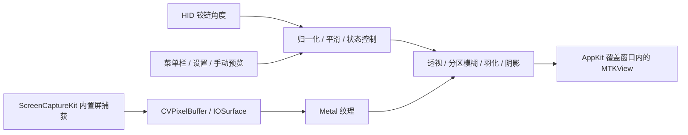

# Bendy / iPhone Duo 翻合盖效果复刻分析

研究日期：2026-09-10。结论：可以实现视觉上高度接近 Bendy 的 macOS App。推荐 Swift + AppKit + ScreenCaptureKit + Metal；最先验证传感器事件与桌面覆盖闭环，再打磨特效。

本文基于 Bendy 官网、网页源码、19.167 秒演示视频、设置截图、Apple 官方 iPhone Duo 动画、Apple API 文档、本机 SDK 和只读硬件探测。未取得 Bendy 原生源码或安装包，不能将下述推荐架构称为它的已确认内部实现。本次交付是分析和探测证据，不是已经可运行的复刻 App。

## 1. iPhone Duo 的效果是什么

Apple 官方页面描述了内外屏及不同姿态间的无缝过渡。其首页 3.034 秒动画中，约 2.02–2.28 秒可以看到：左侧新展开的照片明显模糊、偏暗，右侧图标区域保持较清楚；约 2.53–2.78 秒照片逐渐清晰。这里同时存在物理面板透视和软件清晰度变化，不能把拍摄画面的全部变形都归为 shader。

它的观感可拆成：铰链驱动的空间展开、非均匀模糊、渐变暗部、展开后的清晰收尾。媒体报道也描述了 blur/stretch、gradient、depth-of-field，但没有提供系统内部的数学模型。不能据此断言 Apple 使用了某个滤镜或固定动画曲线。

Bendy 将这种空间展开感转译到笔记本：底部铰链作为视觉支点，整张桌面向后倾斜，上部收窄、失焦、变暗；打开时反向恢复。复刻 Bendy 无需实现 iPhone 的双屏切换、应用布局重排或两块屏幕状态迁移。

参考帧：[Apple 动画关键帧](assets/iphone-duo-frames.png)、[Bendy 演示关键帧](assets/bendy-frames.png)。

## 2. 哪些是已确认事实

| 内容 | 证据及边界 |
|---|---|
| Bendy 读取内置铰链角度 | 官网明确写出 Lid sensor |
| 实时桌面、Metal 倾斜渲染 | 官网明确写出 captures the screen / renders the tilt with Metal |
| 不轮询、不依赖辅助功能技巧 | 官网声明；本次未验证原生内部方式 |
| Silk / Shade / Frost | 官网及设置截图确认三个预设；未取得三套原生参数 |
| 透视、可变模糊、阴影、清除角度 | 官网及截图确认；截图可见 Perspective 100%、Variable blur 65%，不代表所有默认配置 |
| 自动跟随、手动角度、预览 | 设置截图及网页说明确认 |
| macOS 14+、带传感器的 Apple silicon MacBook | 官网要求；不能简化成所有 M 系列均支持 |
| 需要屏幕录制权限 | 官网明确写出；不等于保存视频 |
| 菜单栏暂停、Esc 暂停、打开清除时轻响 | 官网说明；Esc 的具体窗口焦点和权限策略未知 |
| ScreenCaptureKit + 覆盖窗口 | 与已公开行为吻合且可实现的推荐方案，未由原生源码确认 |

没有找到可核对的 Bendy 原生开源仓库。网页源码的参数只能用作可复现视觉参考。

## 3. 网页演示给出的可复用视觉参数

本地留存：[bendy.html](assets/bendy.html)。

| 层 | 网页实现 |
|---|---|
| 展开进度 | `q = clamp(scrollY / 900, 0, 1)`；`p = q*q*(3-2*q)` |
| 缓动 | 每动画帧 `current += (target-current)*0.08`；滚动另有 Lenis 平滑 |
| 透视 | `transform-origin: 50% 100%`；`perspective(1400px) rotateX(p*72deg)` |
| 模糊 | 原图上叠 6 / 16 / 36 px 三档模糊，透明度随 p 变化 |
| 模糊空间分布 | 6 px 层从顶端到高度 75% 衰减；16 px 到 52%；36 px 到 34% |
| 上沿羽化 | 遮罩范围随 p 从 0 增至屏幕高度的 22%，底边不羽化 |
| 阴影 | 顶部左右角径向暗部 + 顶部向下的线性渐变，总强度乘 `0.9*p` |

这解释了它为何比“全屏旋转 + 均匀 blur”更像柔软展开：底边稳定，上部图像与轮廓同时失焦。网页目前只使用平面透视，不需要网格形变或物理模拟。

还有一个不能照抄的差异：网页音效在折叠进度大于 0.8 时触发、小于 0.5 时重新准备；原生 0.3 的文案描述的是打开并清除效果时发声。复刻原生交互应采用后者，不把网页逻辑误当作 App 契约。

## 4. 推荐原生实现



### 4.1 角度输入：HID 服务

用公开 IOKit HID API 枚举传感器。当前可见设备的 VendorID 为 `0x05AC`，ProductID 为 `0x8104`，Usage Page 为 `0x20`，Usage 为 `0x8A`。产品兼容判断应结合设备与元素描述符，不只依赖芯片型号或单一 ProductID。

本机当前只读结果：

- 型号 `MacBookPro18,3`，macOS `27.0`；服务名 `las`，类型 `AppleSPUHIDDevice`。
- `IOHIDDeviceOpen` 和 Feature Report 读取均成功。
- Report 1 长度 3，按已知格式解码返回 `25°`。这是传感器读数，未进行实物量角校准或动态跟随测试。
- 角度 Input 元素的 Usage 为 `0x47F`，报告位宽 9，逻辑范围 0–360。
- 注册 `IOHIDDeviceRegisterInputValueCallback` 后静止监听 4 秒得到 0 次回调。未实际转动盖子，不能由此证明回调路径可用或不可用。

推荐先用 `IOHIDDeviceRegisterInputValueCallback` / `IOHIDDeviceRegisterInputReportCallback` 验证设备的变化报告，注册回调后必须调度 run loop 或 dispatch queue。启动时可做一次 Feature Report 读取以获得初值，避免等下一次变化才知道位置。一次读取不是持续轮询。

公开 LidAngleSensor 参考实现使用 `1/30 s` 定时读取 Feature Report。它可以证明读取途径，但不证明 Bendy 的“不轮询”。若移动验证仍收不到事件，再检查报告配置与驱动行为；不要把定时读取包装成事件驱动，也不要静默假设兼容。

复现命令：

```sh
swift research/probe-lid.swift
swift research/probe-lid-events.swift
```

证据：[读取结果](assets/lid-probe.txt)、[静止事件监听](assets/lid-events.txt)。这些脚本不请求新权限，不改变传感器报告配置，不捕获或保存桌面。

### 4.2 捕获：整张内置屏，排除自身覆盖层

使用 `SCShareableContent` 找到目标 `SCDisplay`，通过显示器 ID 与 `CGDisplayIsBuiltin` 等信息匹配内置屏，不能假定 `NSScreen.main` 就是内置屏。

使用 `SCContentFilter(display:excludingApplications:exceptingWindows:)` 排除自身 App，或精确排除 overlay 窗口。必须在显示 overlay 前建立排除规则，否则会重复捕获自身产生无限镜像。排除整个 App 最简单，但自己的设置窗口也会从捕获中消失，应明确选择。

输出走 `SCStream → CMSampleBuffer → CVPixelBuffer → CVMetalTextureCache → MTLTexture`。这是避免每帧 CPU 图像复制的路径，不应循环转 `NSImage` 或 PNG。纹理和其底层 pixel buffer 需要保留到 GPU 完成，不能过早释放。

以 60 fps 为初始目标，`queueDepth=3` 作为起点，实测延迟与内存再调整；这些是推荐起始值，不是 Bendy 实测值。只保留最新有效帧，消费 `.complete`，静态 `.idle` 时复用上一张纹理。显示器刷新循环独立读取最新角度，即使桌面没有新内容也能继续动画。

### 4.3 Metal：平面透视足够起步

以屏幕底边为轴，先做四顶点、两个三角形的透视平面。令纹理纵坐标 `y=0` 为顶部、`y=1` 为底部：

```text
q = clamp((clearAngle - lidAngle) / (clearAngle - closedAngle), 0, 1)
p = q*q*(3-2*q)
phi = maxVisualTilt * p

u = (x - 0.5) * W
v = (1 - y) * H
k = D / (D + v*sin(phi))
screenX = W/2 + u*k
screenY = H - v*cos(phi)*k
```

`phi` 是视觉旋转角，不是机械铰链角本身；`D` 是相机距离。取例如 110° 清除、10° 近闭合只能作为开发起点，最终要校准并允许用户调整。网页 72° 上限和 1400 px 透视距离可用于视觉拟合，但应按输出尺寸归一化，不能直接把 CSS 像素抄成 Retina 像素。

实际 GPU 实现应使用正确的 clip-space `w` 以获得透视正确 UV，或使用逆投影采样，避免两片三角形接缝。

模糊先用低分辨率多级模糊纹理或 Metal Performance Shaders Gaussian blur，按垂直位置混合：越远离底部，越偏向大模糊半径。不要给每个全分辨率像素做几十次以上随机采样。复用模糊纹理，当桌面纹理未变时只更新几何和混合参数。

再添加上沿羽化与顶部阴影。第一版不需要弹簧物理、3D 场景引擎或复杂网格；只有平面版本与参考视频存在明确差异时才增加弯曲。

角度平滑采用时间相关系数，例如 `a=1-exp(-dt/tau)`、`value += a*(target-value)`，避免网页固定每帧 0.08 在 60/120 Hz 上手感不同。延迟和轻微拖尾需实测，不能为了“顺滑”堆叠多个慢滤波器。

### 4.4 覆盖窗口：真正的实现难点

SwiftUI 管菜单栏、设置和预览；直接 AppKit 管理无边框 `NSWindow` / `NSPanel`，内部使用 `MTKView`。窗口层级、全屏辅助行为、焦点及显示器切换由一个明确的控制器负责。

必须考虑：

1. **覆盖整个内置显示器区域。** 使用完整 `frame`，不能只覆盖扣除菜单栏和 Dock 的 `visibleFrame`。原图缩小之后露出的区域应由黑色或受控背景遮住；透明底会露出未变形桌面，产生两套画面。
2. **不递归捕获。** 在首次显示和窗口重建时都维持排除规则。不要仅靠 `NSWindow.sharingType` 假定 ScreenCaptureKit 一定排除自身。
3. **恢复像素对齐。** `p=0` 时变换、模糊、阴影和遮罩回到恒等状态；呈现新鲜清晰帧后撤掉 overlay，避免跳一下。
4. **输入坐标不会跟着图像旋转。** App 的真实按钮还在原位置。第一版应把效果作为短暂过渡：生效时不承诺正常点击，必要时拦截鼠标；恢复后立即放行。永久点击穿透会点击到错误位置。为第三方 App 重映射输入会显著扩大范围。
5. **Esc 需要单独设计。** 非激活、点击穿透窗口不能天然收到全局 Esc。菜单栏暂停可以先保证；如需后台单键 Esc，另行核验全局热键/输入监听的限制和权限，不宣称无需额外权限就必然可用。
6. **保持系统合盖、睡眠、锁屏语义。** 锁屏或捕获中断时撤掉旧桌面纹理并暂停；唤醒后取得新帧再恢复。不要阻止睡眠来维持特效，也不要宣称普通 App 能在登录界面显示同样效果。
7. **外接屏与全屏空间。** 首版只影响内置屏。跨 Spaces、全屏应用、Dock、菜单栏、刘海、缩放、HDR 的行为都需要实际场景验证。

### 4.5 生命周期与功耗

```text
不支持 / 无权限 → 显示原因与手动样例预览
空闲清晰 → 待命
进入作用角度 → 准备捕获 → 收到有效帧 → 显示效果
角度继续变化 → 更新同一渲染链
超过清除角度 → 回到恒等画面 → 撤掉覆盖层 → 降低或停止捕获
暂停 / 锁屏 / 睡眠 / 捕获失败 → 立即撤掉覆盖层并释放帧
```

传感器事件少，并不等于整条管线零功耗。停止 `SCStream` 更省电，但快速合盖可能遇到启动延迟；保持低频捕获更及时，但有持续成本。先测首次出帧延迟，再决定低频待命还是提前在较大角度启动，不能同时承诺零空闲功耗和零冷启动延迟。

清除阈值要有小幅迟滞，防止角度抖动反复显示/隐藏、重复播放音效。音效与状态迁移绑定，每次有效打开仅触发一次。

## 5. 最小开发与验收顺序

| 阶段 | 工作 | 通过条件 |
|---|---|---|
| A：角度和视觉 | 实际移动盖子验证事件；制作手动滑杆 + 固定测试图的 Metal 预览 | 角度单调、能反向和中途停住；无传感器时显示真实状态；底边稳、上部逐渐失焦 |
| B：真实桌面闭环 | 屏幕权限、内置屏捕获、自排除、overlay、打开恢复、暂停 | 视频/窗口内容在覆盖层内继续更新；没有套娃；清除时无重影/错位；退出可靠 |
| C：跟盖产品化 | 接入传感器，平滑/迟滞，三种预设、设置、声音、菜单栏、睡眠恢复 | 慢开合、快开合、阈值抖动、全屏应用和外接屏通过；不影响系统正常睡眠 |

记录传感器→呈现延迟、捕获首次出帧、帧耗时、丢帧、空闲/活动功耗。目标可先设为 60 fps、稳定跟手，但测量前不承诺能达到某个固定延迟或功耗数字。

不需要先做账号、许可证、自动更新、DMG 分发或逐窗口控制。已有数据足够启动上述验证；“完全相同”的最终判断还需要取得原生 Bendy 对照运行并逐项比较，而不是只看官网视频。

## 6. 来源

1. [Bendy 官网](https://trybendy.app/)、[原生演示视频](https://trybendy.app/demo.mp4)、[设置截图](https://trybendy.app/settings.png)。
2. [Apple iPhone Duo](https://www.apple.com/iphone-duo/)、[官方首页展开动画](https://www.apple.com/105/media/us/iphone-duo/2026/9305e4b9-72d9-4c05-9381-b572adadd5e5/anim/hero/large_2x.mp4)。
3. [MacRumors 现场体验，2026-09-09](https://www.macrumors.com/2026/09/09/iphone-duo-hands-on/)。
4. [Gulf News 动画描述](https://gulfnews.com/technology/iphone-duos-folding-animation-is-a-feature-no-other-foldable-phone-have-1.500669297)。仅用于辅助理解视觉描述，未采用与官方不一致的硬件规格。
5. [Apple：Capturing screen content in macOS](https://developer.apple.com/documentation/screencapturekit/capturing-screen-content-in-macos)。
6. [Apple：SCContentFilter 排除应用](https://developer.apple.com/documentation/screencapturekit/sccontentfilter/init(display:excludingapplications:exceptingwindows:))、[SCFrameStatus](https://developer.apple.com/documentation/screencapturekit/scframestatus)。
7. [LidAngleSensor 固定提交的读取实现](https://github.com/samhenrigold/LidAngleSensor/blob/f7e4e5cb46fe13a518091ce5d47f0ec2e3fecd80/LidAngleSensor/LidAngleSensor.swift)，Apache-2.0；本次未将其代码并入复刻 App。
8. 本机 Xcode-beta macOS SDK 的 `IOHIDDevice.h`、`SCStream.h`、`CVMetalTextureCache.h`，以及随文探测脚本与输出。所用捕获核心 API 在 SDK 中标注 macOS 12.3+，不代表已在 macOS 14 跑过兼容测试。

检索使用 Ketch：Exa / Tavily 返回成功，本次返回结果没有 provider errors。研究附件包含第三方参考素材，只作为分析证据，不作为拟发布 App 的素材或品牌。
